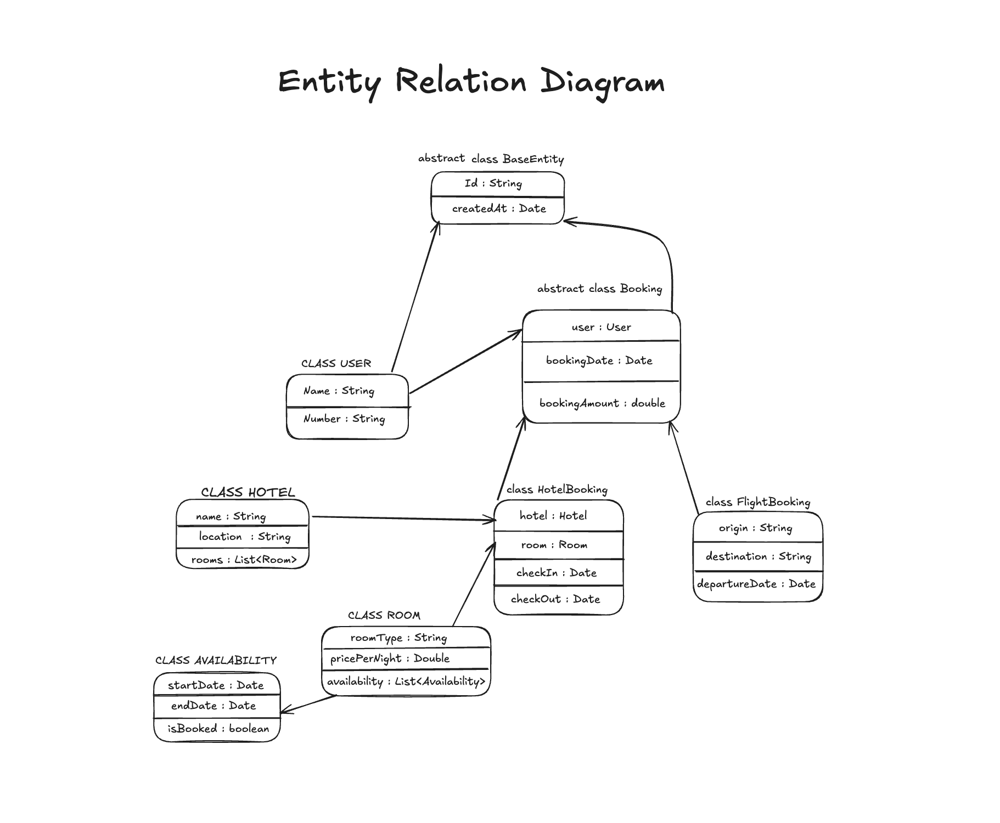
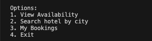

# HOTEL_BOOKING

## Project Description
This project is a hotel booking system that allows users to book rooms in various hotels. 
It includes features such as 
 1. Checking room availability.
 2. Searching Available Room based on city and check in date's.
 3. Book rooms.
 4. View My bookings

## Prerequisites
- Java 8 or higher
- Maven 3.6 or higher
- Git

## Getting Started

### Cloning the Repository
To clone the repository, open your terminal and run the following command :
```sh
git clone https://github.com/rohanjadhav05/hotel_booking.git
```

### Navigating to the Project Directory
Change to the project directory :
```sh
cd hotel_booking/hotel_booking/src/main/java
```

### Compiling the Project
Use the following command to compile your java code : 
```sh
javac Main.java
```

### Running the Application
To run the application, use the following command :
```sh
java Main
```

## Project Structure
The project structure is as follows : 
```
hotel_booking/
├── pom.xml
├── README.md
├── src
│   ├── main
│   │   ├── java
│   │   │   └── com
│   │   │       └── bookingSystem
│   │   │           ├── model
|   |   |                   ├── Availability.java
|   |   |                   ├── Booking.java
|   |   |                   ├── Hotel.java
|   |   |                   ├── Room.java
|   |   |                   ├── User.java 
│   │   │           ├── service
|   |   |                   ├── BookingService.java
|   |   |                   ├── HotelService.java
│   │   │           └── util
|   |   |                   ├── BookingUtil.java
|   |   |       └── Main.java
│   │   └── resources
│   └── test
│       ├── java
│       └── resources
```

## Entity Relation Diagram
Below is the Entity relation diagram for the hotel booking system :



### Explanation of the Diagram

1. `Availability` : Represents the availability status of a room for a specific date range. It  includes fields such as start date, end date, and a boolean indicating whether the room is available.
2. `Booking` : Represents a booking made by a user. It includes details such as booking ID, user information, room information, hotel information, check-in date, and check-out date.  
3. `Hotel` :  Represents a hotel. It includes details such as  name, location, and a list of rooms available in the hotel, here `Booking` class is having one to many relation with `Hotel` entity and `Hotel` is many to one relation with entity `Room`.
4. `Room` : Represents a room in a hotel. It includes details such as room type, pricePerNight, availability status. Here Entity `Room` is having one to many relation with `Availability` entity 
5. `User` : Represents a user of the system. It includes user details such as user ID, name, contact information, and booking history.

## Functionalities Demo

When you run the Main.java file you will see the following options 



### 1. Checking Room Availability
When the user enter's `1` to check room availability. The system will then display the available rooms. Below is a screenshot of the availability check process :


### 2. Search hotel by city
When the user enter's `2` to search hotel by city. The system will then give a choice to user 
to select city's which is present in Database


based on selected city suppose user enter's `1` and city `Mumbai` is selected then user need to enter the Check-in Date and Check-out Date in the correct format i.e `YYYY-MM-DD`,
when user enter the check-in date and check-out date in correct format the system will check in 
database do we have Hotel's have availability for those days if present will print the Hotel name with the room type available, check image for reference


#### 1. Book Hotel

then we get the available hotels if user want to book a hotel then he need to enter `1` proceed with booking hotel, where he need to add the Booking details like name, contact number, based on the available hotel in city he will be shown options in which hotel he need's to select 1 option, and the room type after entering the details we will get a confirmation message that hotel has been booking with the booking details.


#### 2. Back

if user enter option `2` then he will be navigated to previous menu

### 3. My Bookings

If user want to check his booking then when he enter's option `3` and selected My Bookings she must enter the name with which he had made the booking by entering the name the list of booking made my user will be displayed.


### 4. Exit

When user select option `4` the program will stop its execution.

## OOPS Concepts Implementation

1. **Abstraction**: 
    - The project uses abstraction to hide complex implementation details and expose only the necessary functionalities. For example, the `BookingService` class provides methods to book rooms without exposing the underlying logic of how the booking is processed.

2. **Encapsulation**: 
    - Encapsulation is achieved by using private fields and public getter and setter methods in classes like `Hotel`, `Room`, `User`, etc. This ensures that the internal state of an object is protected from unauthorized access and modification.

3. **Polymorphism**: 
    - Polymorphism is implemented through method overriding and interface implementation. For instance, different types of rooms (e.g., SingleRoom, DoubleRoom) can override the `getPricePerNight` method to provide specific pricing logic.

4. **Modularity**: 
    - The project is organized into different packages such as `model`, `service`, and `util`, each containing related classes. This modular structure makes the codebase more manageable and promotes separation of concerns.

These OOP principles help in creating a well-structured, maintainable, and scalable hotel booking system.


## Contact
If you have any questions or need further assistance, feel free to contact the project maintainer at rohan.jadhav511@gmail.com.

Thank you for using our hotel booking system!


